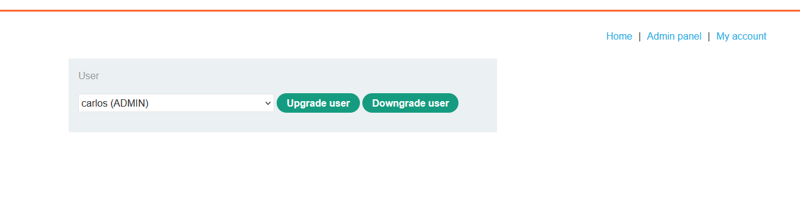
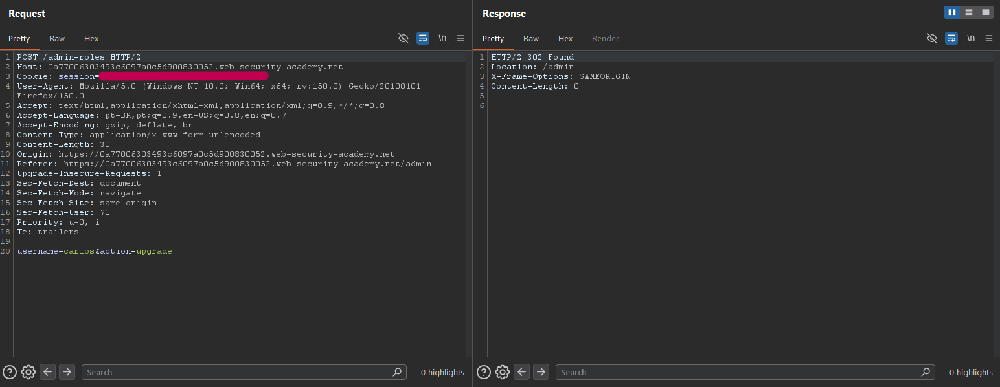
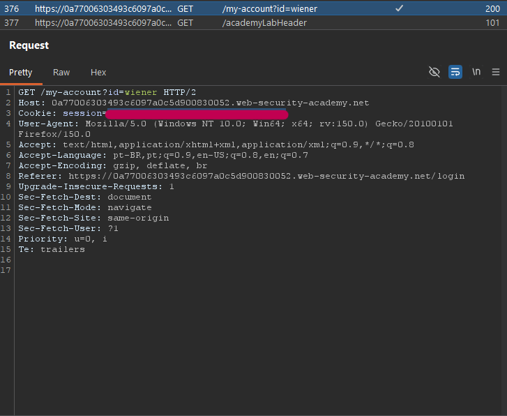
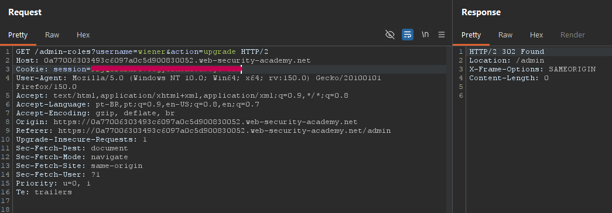
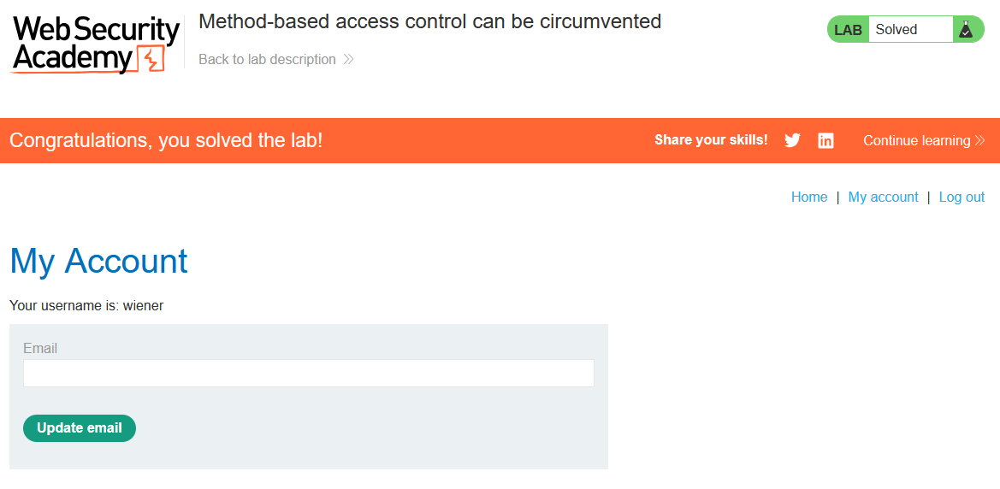

# Lab 06 - Access Control Vulnerability

## Information
> Difficulty: Easy  
> Date: 17-05-2026

---

## Objective
Log in using the credentials wiener:peter and exploit the flawed access controls to promote yourself to become an administrator.

### Explanation
Log in using an administrator account and access the administration panel to promote the user [Normal]

When we try to upgrade a user:

Now logout and log in with your Wiener username:

The intercepted administrative request was modified by changing the HTTP method from POST to GET and replacing the administrator session cookie with a standard user session cookie, successfully bypassing the access control validation:

