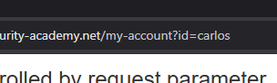
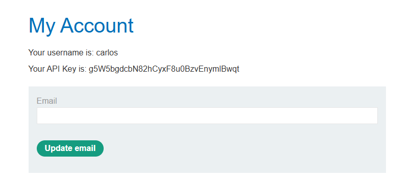
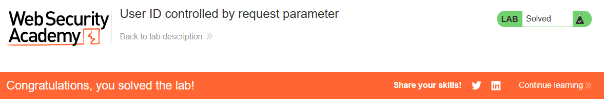

# Lab 07 - Access Control Vulnerability

## Information

> Difficulty: Easy  
> Date: 17-05-2026

# Objective

This lab has a horizontal privilege escalation vulnerability on the user account page, but identifies users with GUIDs.

## Exploitation

Login using the credentials wiener:peter

### Explanation

Login as user wiener:

Changing the id wiener to carlos directly in the URL:

Carlos API:

