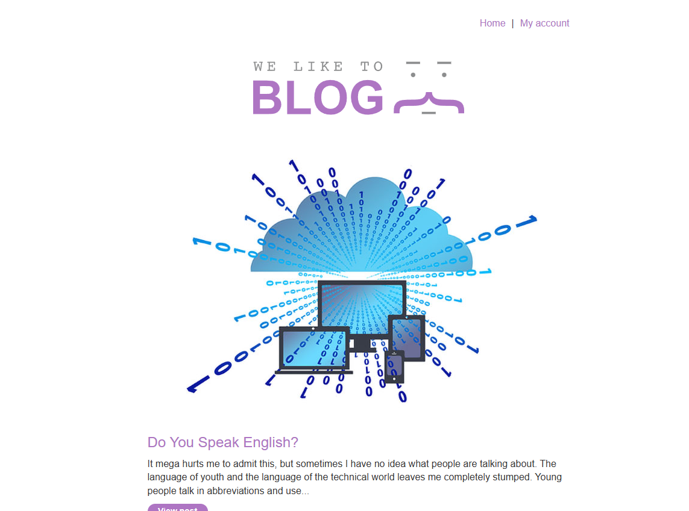
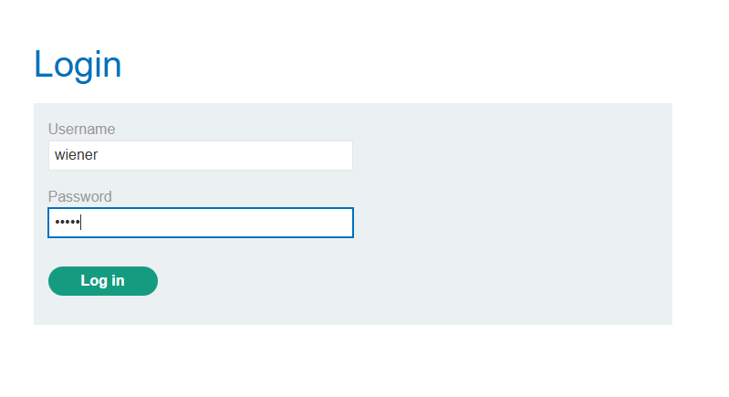
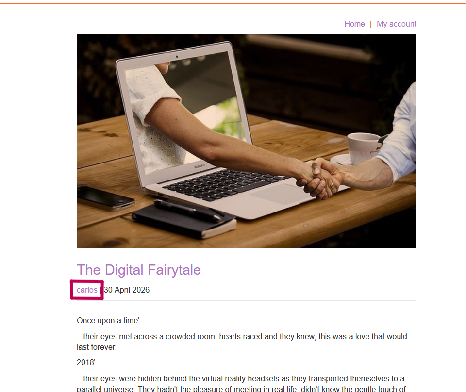
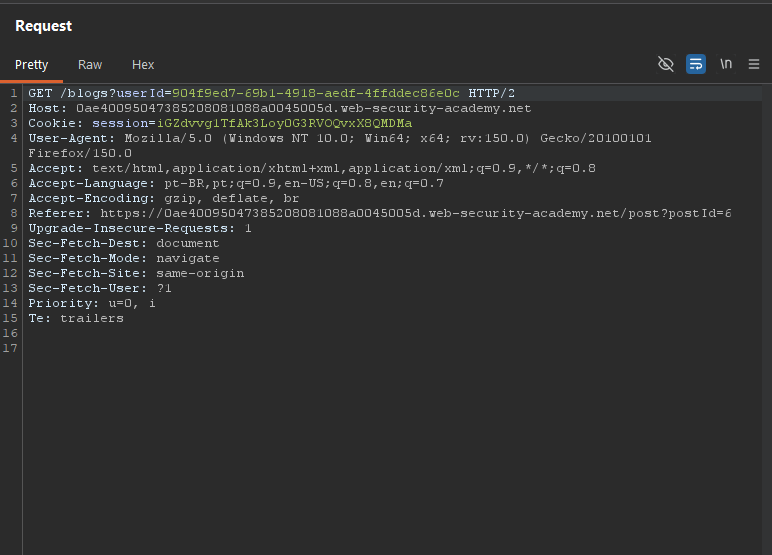
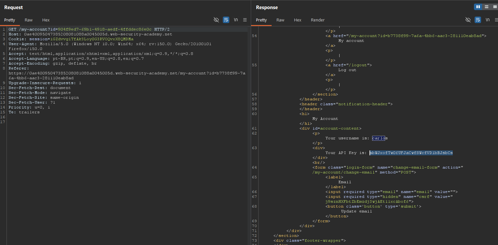
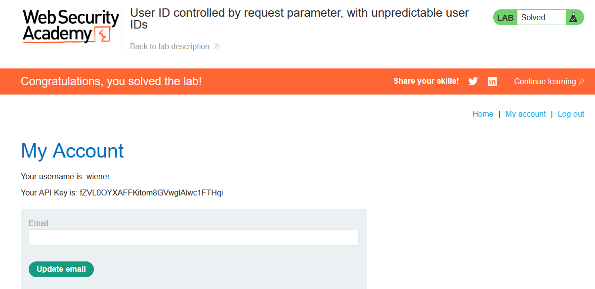

# Lab 08 - Access Control Vulnerability


## Information

> Difficulty: Easy <br>
> Date: 18-05-2026


# Objective
This lab has a horizontal privilege escalation vulnerability on the user account page, but identifies users with GUIDs.

To solve the lab, find the GUID for carlos, then submit his API key as the solution.

## Exploitation
**Home page:**



**Login as user wiener:**



**In the home page, we can view Carlos's post:**




**While viewing Carlos's blog post, the application exposed his user identifier (GUID) in the request URL:**
```html
<p><span id=blog-author><a href='/blogs?userId=904f9ed7-69b1-aedf-4ffddec86e0c'>carlos</a></span> | 23 April 2026</p>
```


**Using Burp Suite, it was possible to intercept the request and obtain Carlos's GUID.**
**After identifying the GUID, the /my-account endpoint was modified to reference Carlos's identifier instead of the current authenticated user:**



**The server returned Carlos's account page, including his API key:**



