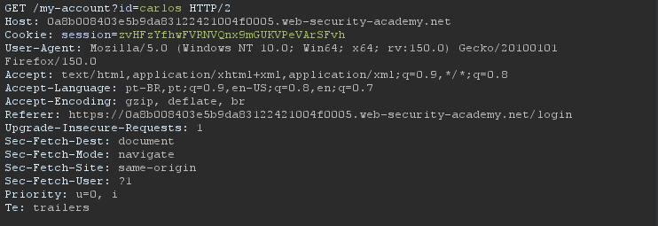
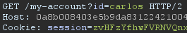
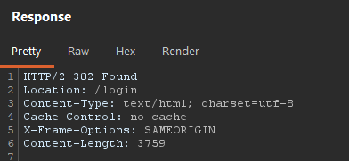
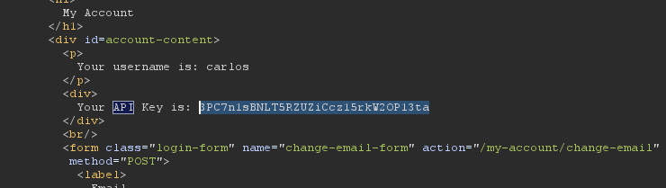
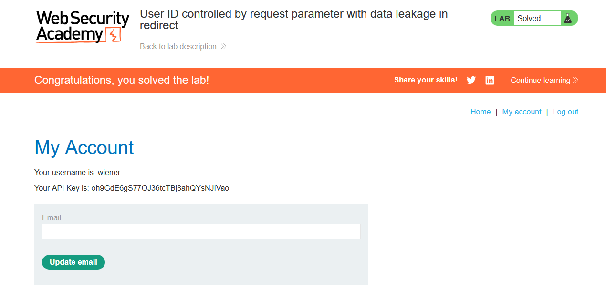

# Lab 09 - Access Control Vulnerability

## Information
> Difficulty: Easy  
> Date: 18-05-2026
---
### Objective
 This lab contains an access control vulnerability where sensitive information is leaked in the body of a redirect response.
To solve the lab, obtain the API key for the user carlos and submit it as the solution. 

### Explanation
**Login as user wiener:**

**After authentication, I navigated to the My Account page.**

**Intercepting the request**
Using Burp Suite, I intercepted the request sent when accessing the account page.
The application used the user identifier directly in the request:

**Modifying the parameter for carlos:**

### Conclusion

The application was vulnerable to Broken Access Control because it exposed sensitive information in the body of a redirect response without properly validating user authorization.