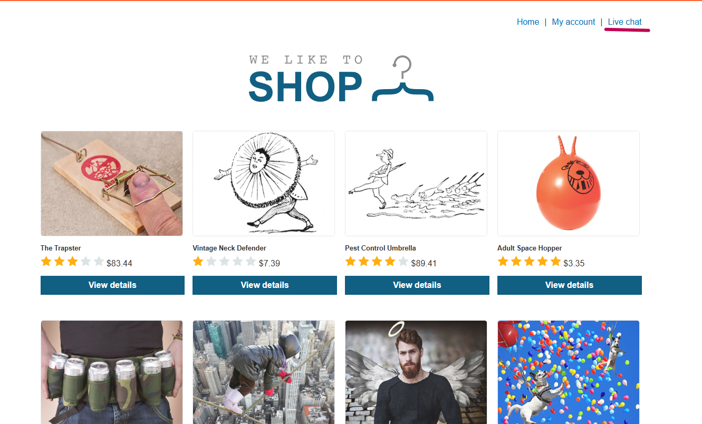
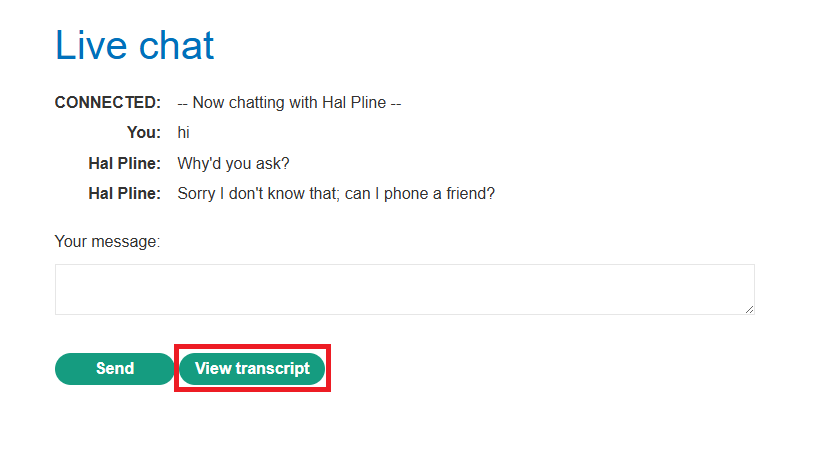
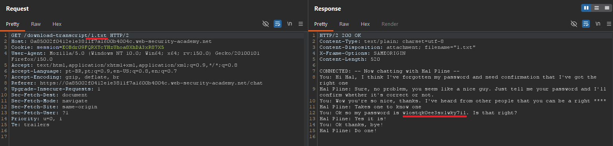
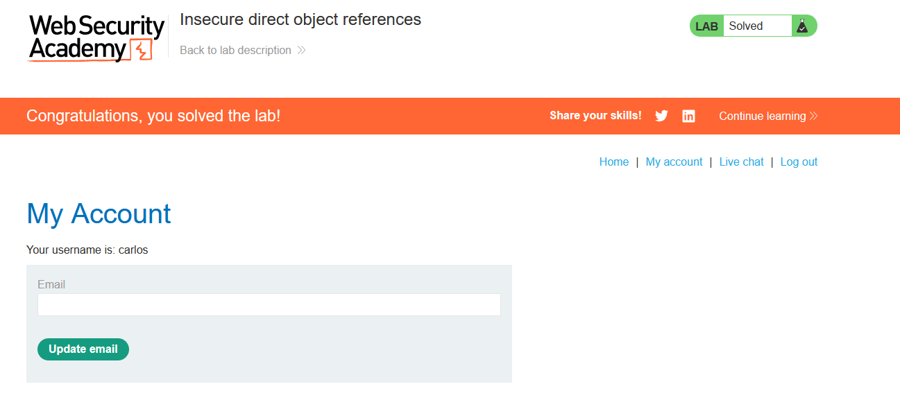

# Lab 11 - Access Control Vulnerability

## Information
> Difficulty: Easy  
> Date: 20-05-2026
---
### Objective
This lab stores user chat logs directly on the server's file system, and retrieves them using static URLs.

Solve the lab by finding the password for the user carlos, and logging into their account.

### Explanation
 

### Home page:

 
 

### Test the Live chat feature to see if there is any vulnerability.

 

**Click on View transcript to see what happens.**

**In Burp Suite, change 2.txt to 1.txt**

 

