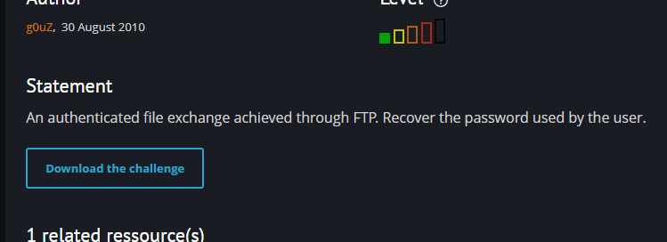

# FTP - authentication

## Information
> Difficulty: Easy  
> Date: 19-05-2026
---
### Objective
An authenticated file exchange achieved through FTP. Recover the password used by the user.

---

### Explanation

 
Download the challenge file:

 
 
Open the capture in Wireshark and apply the following filter to display only FTP packets:

 
 
While analyzing the FTP traffic, we can identify the PASS command, which contains the user's password in plaintext.

Select the packet and inspect its contents:

 
 
Done:

