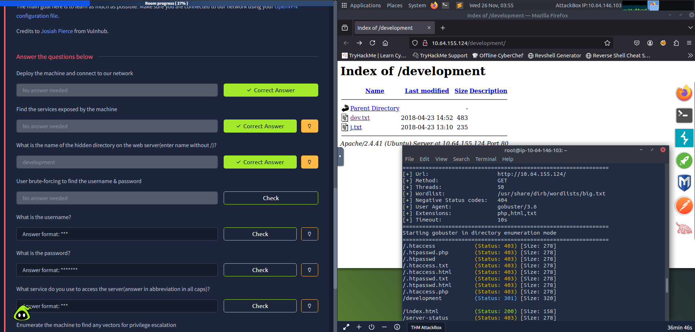
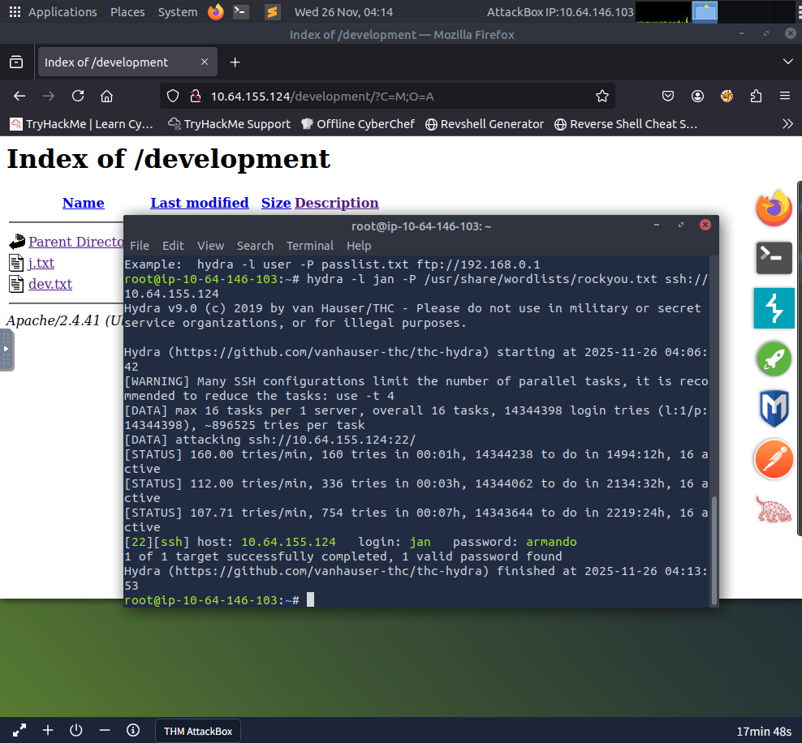

# Basic Pentesting – TryHackMe Write-up

> Difficulty: Easy  
> Date: 26-11-2025  

### 1 - nmap  
nmap -Pn -sC -sV -v 10.64.155.124  
PORT    STATE SERVICE     VERSION
22/tcp  open  ssh         OpenSSH 8.2p1 Ubuntu 4ubuntu0.13 (Ubuntu Linux; protocol 2.0)  
80/tcp  open  http        Apache httpd 2.4.41 ((Ubuntu))   
139/tcp open  netbios-ssn Samba smbd 4.6.2  
445/tcp open  netbios-ssn Samba smbd 4.6.2  
 
---

2 - gobuster dir -u http://10.64.155.124/ -w /usr/share/dirb/wordlists/big.txt -t 50 -x php,html,txt  
/development          (Status: 301) [Size: 320] [--> http://10.64.155.124/development/]  

---

3 - inside [http://10.64.155.124/development/]   
an exposed file was found which contained sensitive system information, including the contents of -> etc/shadow  

---

4 - enum4linux -a 10.64.155.124  
users - jan and kay  

---

5 - ssh brute force with hydra:  
login: user / password: armando   

---

6 - ssh access

nmap - scan v 
gobuster - hidden directory /development  
enum4linux - identified valid users (jan, kay)  
hydra - brute force → cracked jan’s password v 

### Gobuster scan

### Hydra scan

